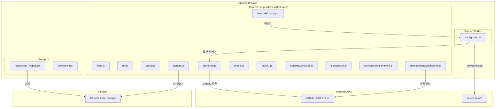
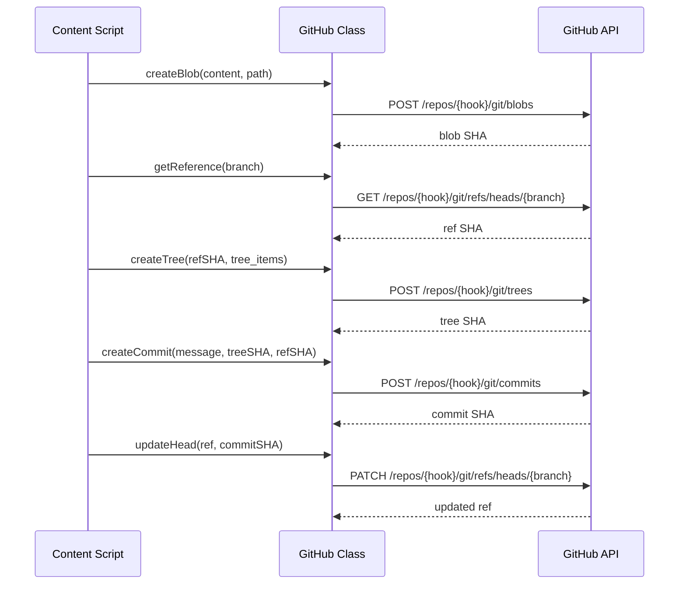
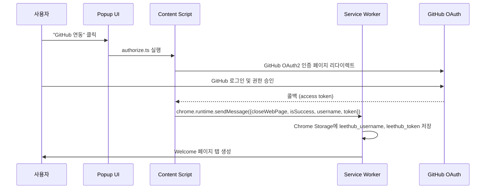

# Architecture

## Chrome Extension 아키텍처

LeetHub는 Chrome Extension Manifest V3 기반으로, Service Worker(background script)와 Content Script가 분리된 구조입니다.

### 전체 시스템 다이어그램



### Content Script 실행 흐름

Content Script는 `manifest.json`에서 `<all_urls>` 매칭으로 모든 페이지에 주입되며, `document_idle` 시점에 ISOLATED world에서 실행됩니다.

```
manifest.json content_scripts 로딩 순서:
1. toast.js        → 토스트 알림 UI 렌더링
2. util.js         → 공통 유틸리티 함수
3. github.js       → GitHub API 클래스 (GitHub class)
4. authorize.js    → OAuth2 인증 흐름 시작/처리
5. storage.js      → Chrome Storage 래퍼
6. enable.js       → 확장 활성화/비활성화 토글
7. oauth2.js       → OAuth2 토큰 갱신/검증
8. leetcode/variables.js      → 전역 변수 초기화
9. leetcode/util.js           → LeetCode 전용 유틸
10. leetcode/parsing.ts       → 문제 제목, 난이도, 코드 파싱
11. leetcode/programmers.ts   → 프로그래머스 파싱
12. leetcode/uploadfunctions.ts → GitHub 업로드 실행
```

### Background Script (Service Worker)

`background.ts`는 Webpack으로 별도 번들링되어 `dist/background.js`로 출력됩니다. Manifest V3의 Service Worker로 등록됩니다.

**주요 역할:**
1. **OAuth2 콜백 처리**: 인증 성공/실패 시 Chrome Storage에 토큰 저장 및 Welcome 페이지 이동
2. **solved.ac API 프록시**: Content Script에서 CORS 제한이 있는 solved.ac API를 대신 호출
3. **메시지 라우팅**: `chrome.runtime.onMessage` 리스너로 Content Script와 통신

```typescript
// background.ts 메시지 핸들러 구조
chrome.runtime.onMessage.addListener(handleMessage)

handleMessage(request, sender, sendResponse):
  if request.closeWebPage && request.isSuccess:
    → Chrome Storage에 username, token 저장
    → Welcome 페이지 탭 생성
  
  if request.closeWebPage && !request.isSuccess:
    → 인증 실패 알림, 현재 탭 닫기
  
  if request.sender === 'leetcode' && request.task === 'SolvedApiCall':
    → solved.ac API 호출 후 sendResponse로 결과 반환
```

### GitHub API 클라이언트 (GitHub 클래스)

`github.ts`의 `GitHub` 클래스는 Git 트리 기반의 커밋 생성 파이프라인을 구현합니다.



**GitHub 클래스 메서드:**

| 메서드 | 설명 | API 엔드포인트 |
|--------|------|----------------|
| `getDefaultBranchOnRepo()` | 기본 브랜치 확인 | `GET /repos/{hook}` |
| `getReference(branch)` | 브랜치 ref SHA 가져오기 | `GET /repos/{hook}/git/refs/heads/{branch}` |
| `createBlob(content, path)` | 파일 내용으로 blob 생성 | `POST /repos/{hook}/git/blobs` |
| `createTree(refSHA, items)` | Git tree 생성 | `POST /repos/{hook}/git/trees` |
| `createCommit(msg, tree, ref)` | 커밋 생성 | `POST /repos/{hook}/git/commits` |
| `updateHead(ref, commitSHA)` | HEAD 업데이트 | `PATCH /repos/{hook}/git/refs` |
| `getTree()` | 현재 트리 조회 | `GET /repos/{hook}/git/trees` |

### OAuth2 인증 흐름



### Chrome Storage 데이터 구조

```typescript
interface ChromeStorageData {
  leethub_username: string;    // GitHub 사용자명
  leethub_token: string;       // GitHub OAuth 토큰
  pipe_leethub: boolean;       // 인증 파이프라인 상태
  // ... 추가 설정
}
```

### Webpack 빌드 파이프라인

두 가지 빌드 프로세스가 병행됩니다:

1. **Background Script**: `webpack.config.js` → `src/background.ts` → `dist/background.js`
2. **Popup & Content Scripts**: `react-app-rewired build` → `build/` 디렉토리

```
빌드 결과물 구조:
build/
├── background.js        (Webpack 번들)
├── index.html           (Popup)
├── static/              (React 빌드 출력)
├── toast.js             (Content Script)
├── util.js
├── github.js
├── authorize.js
├── storage.js
├── enable.js
├── oauth2.js
└── leetcode/
    ├── variables.js
    ├── util.js
    ├── parsing.js
    ├── programmers.js
    └── uploadfunctions.js
```
